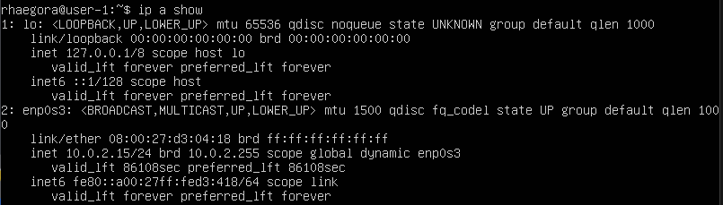
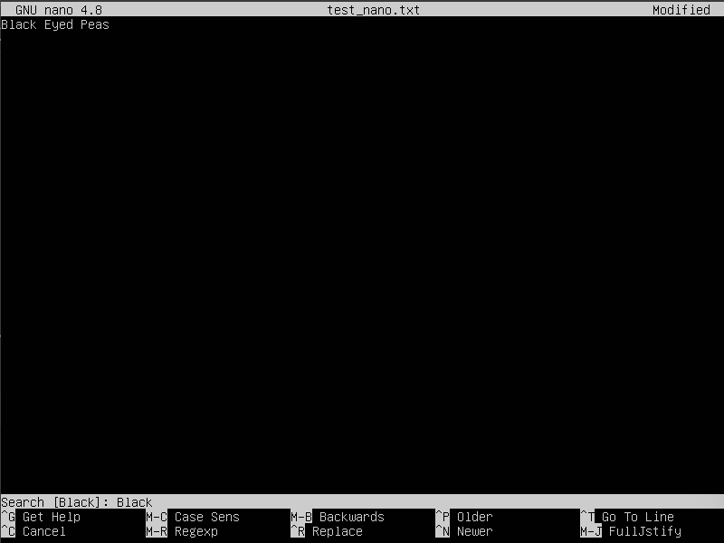

## Part 1. Установка ОС

### Установить Ubuntu 20.04 Server LTS без графического интерфейса. (Используем программу для виртуализации - VirtualBox)
* Узнайте версию Ubuntu, выполнив команду cat /etc/issue.

## Part 2. Создание пользователя

### Создать пользователя, отличного от пользователя, который создавался при установке. Пользователь должен быть добавлен в группу adm.

* Пользователь был создан путем выполнения команды "sudo useradd strn":  

* Пользователь был добавлен в группу adm, выполнив команду "sudo usermod -a -G adm strn";

* Список пользователей и папок отобразится при выполнении команды "cat /etc/passwd".

## Part 3. Настройка сети ОС

* Сначала установите необходимые инструменты net-tools, выполнив команду "sudo apt install net-tools".

* Имя машины было установлено выполнением команды "hostnamectl set-hostname user-1":  

* После перезагрузки системы обновить имя пользователя, выполнив команду "shutdown -r now".

* Часовой пояс был установлен выполнением команды "sudo timedatectl set-timezone Europe/Moscow":

* Выведите на экран список интерфейсов, выполнив команду "ifconfig -a":

 * lo (loopback device) - виртуальный интерфейс, присутствующий по умолчанию в любой ОС Linux. Он используется для отладки сетевых программ и запуска серверных приложений на локальной машине. С этим интерфейсом всегда связан адрес 127.0.0.1;

* Получение IP-адреса от DHCP с помощью команды "ip a show":

  * DHCP (Dynamic Host Configuration Protocol) - протокол управления сетью, используемый для автоматизации процесса конфигурирования устройств в IP-сетях, что позволяет им использовать такие сетевые сервисы, как DNS, NTP и любой протокол связи на базе UDP или TCP;

* Наш IP из DHCP 10.0.2.15, маска 24;

* Сначала установите утилиту curl, выполнив команду "sudo apt-get install curl";

* Опредилить и вывести внешний IP-адрес шлюза (ip), выполнив команду "curl ident.me":

* Внешний IP-адрес - 185.165.160.236;

* Выведите на экран внутренний IP-адрес шлюза, он же ip-адрес по умолчанию (gw), выполнив команду "ip route | grep default":

* Задать статичные (заданные вручную, а не полученные от DHCP сервера) настройки ip, gw, dns (использовать публичный DNS серверы, например 1.1.1.1 или 8.8.8.8). Для этого необходимо выполнить команду "sudo nano /etc/netplan/00-unstaller-config.yaml":
* Установка статических настроек ip, gw, dns путем редактирования файла; 

* Вывести настройки на экран, выполнив команду "cat /etc/netplan/00-installer-config.yaml":

* Для вступления изменений в силу необходимо использовать команду "sudo netplan apply";

* Перезагрузить виртуальную машину командой "shutdown -r now";

* Убедиться, что статичные сетевые настройки (ip, gw, dns) соответствуют заданным ранее. Отобразите все настройки, выполнив команду "cat /etc/netplan/00-installer-config.yaml";

* Пропинговать удаленные хосты 1.1.1.1 и ya.ru. Выполнив команды "ping -c 5 1.1.1.1" и "ping -c 5 ya.ru":

## Part 4. Обновление ОС:

* Обновляем системные пакеты, выполнением команд "sudo apt-get update" и "sudo apt-get dist-upgrade";

* Повторно вводим последнюю команду, появится сообщение, что обновления отсутствуют.

## Part 5. Использование команды sudo:

* Разрешить пользователю strn, созданному в Part 2, выполнять команду sudo, используя команду "sudo adduser strn sudo";

  * Sudo - это программа для Unix-подобных компьютерных операционных систем, которая позволяет пользователям запускать программы с привилегиями другого пользователя, по умолчанию суперпользователя. Основное назначение sudo - запуск команды от имени другого пользователя, обычно root. Смысл выполнения команды от имени root заключается в том, что root обладает повышенными правами, и, используя sudo, обычный пользователь может выполнить действия, для которых у него нет достаточных прав. 

* Что бы поменять hostname ОС от имени пользователя strn, созданного в пункте Part 2, сначала нужно создать пароль, т.к. по умолчанию у нового пользователя нет пароля, выполнив команду "sudo passwd strn" а далее "sudo su strn";

* Измените имя хоста ОС через пользователя, созданного в части 2, выполнив команду "sudo hostnamectl set-hostname estrina";

* Отобразите новое имя хоста, выполнив команду "hostname":  

## Part 6. Установка и настройка службы времени:

* Настройте службу автоматической синхронизации времени, выполнив команду "sudo timedatectl set-ntp on";

* Вывести время часового пояса, в котором я нахожусь в данный момент, выполнив команду "timedatectl show":

## Part 7. Установка и использование текстовых редакторов

* Установить текстовые редакторы VIM, плюс любые два по желанию: "sudo apt install nano", "sudo apt install joe" и "sudo apt install vim";

* Создайте файл с редактором NANO, выполнив команду "nano test_nano.txt";

* Запишите в файл никнейм:

  * Для выхода с сохранением изменений нажмите комбинацию "control" + "X", после нажмите "Y" и "Enter";
 
* Создать файл с редактором VIM, выполнив команду "vim test_vim.txt";
 
* Записать в файл никнейм:

  * Для выхода с сохранением изменений нажмите "esc" после записи ":wq" и нажмите "Enter";

* Создать файл с редактором JOE, выполнив команду "joe test_joe.txt";

* Записать в файл никнейм:

  * Для выхода с сохранением изменений нажмите комбинацию "control" + "K", после нажмите "Q" и нажмите "Y"; 

* Открыть файл с помощью редактора NANO, выполнив команду "nano test_nano.txt";

* Заменить никнейм на строку "21 School 21" и закрыть файл без сохранения изменений":

* Для выхода без сохранения изменений нажмите комбинацию "control" + "С", после нажать "Y";

* Откройте файл с помощью редактора VIM, выполнив команду "vim test_vim.txt";

* Заменить никнейм на строку "21 School 21" и закрыть файл без сохранения изменений":

  * Для выхода без сохранения изменений нажмите "esc", после написать ":q!" и нажмите "Enter";

* Откройте файл с помощью редактора JOE, выполнив команду "joe test_joe.txt";

* Заменить никнейм на строку "21 School 21" и закрыть файл без сохранения изменений":

  * Для выхода без сохранения изменений нажмите комбинацию "control" + "K" после нажатия "Z"; 

* Открыть файл с помощью редактора NANO, выполнив команду "nano test_nano.txt";

* Записать в файл "Black Eyed Peas";

* Найти в файле "Black":  

* Заменить "Black" на "White":  

* Открыть файл с помощью редактора VIM, выполнив команду "vim test_vim.txt";

* Записать в файл "Black Eyed Peas";

* Найти в файле "Black":  
 

* Заменить "Black" на "White":  

* Открыть файл с помощью редактора JOE, выполнив команду "joe test_joe.txt";

* Записать в файл "Black Eyed Peas";

* Найти в файле "Black":  

* Заменить "Black" на "White":  

## Part 8. Установка и базовая настройка сервиса SSHD:

* Установите службу SSH, выполнив команду "sudo apt-get install ssh";

* Установите службу OpenSSH, выполнив команду "sudo apt install openssh-server";

* Добавьте автозапуск службы при каждой загрузке системы, выполнив команду "sudo systemctl enable sshd";

* Откройте файл sshd_config, выполнив команду "sudo nano /etc/ssh/sshd_config";

* Изменить в строку "Port 22" на "Port 2022":  

* Показать наличие процесса sshd, выполнив команду "ps -C sshd":

  * ps (показывает запущенные процессы, выполняемые пользователем в окне терминала);
  * ps -e или ps -A (Чтобы просмотреть все запущенные процессы);
  * ps -d (Чтобы показать все процессы, кроме лидеров сессии);
  * ps -d -N (можно инвертировать вывод с помощью переключателя -N. Например, если хочу вывести только лидеров сеансов)
  * ps T (увидеть только процессы, связанные с этим терминалом);
  * ps r (просмотреть все работающие (running) процессы);
  * ps -p 'pid' (если вы знаете идентификатор процесса PID, вы можете просто использовать следующую команду, для вывода процесса с этим 'pid');
  * ps -p 'pid1' 'pid2'
  * ps U 'userlist' (найти все процессы, выполняемые конкретным пользователем);
  * ps -ef (получить полный список); 
  
* Необходимо установить net-tools, выполнив команду "sudo apt install net-tools";

* Используя команду "netstat -tan":  

    
* Объясните смысл ключей -tan, значение каждого выходного столбца, значение 0.0.0.0. в отчете:
  * -t - показывать только TCP-порты;
  * -a - показывать как прослушивающие, так и не прослушивающие сокеты;
  * -n - показывать числовые адреса, а не пытаться определить символьные имена хостов, портов или пользователей;
  * 0.0.0.0 - немаршрутизируемый IPv4-адрес, который может использоваться для различных целей, в основном в качестве адреса по умолчанию или адреса-заместителя;
  * Proto - протокол, используемый сокетом;
  * Recv-Q - количество байтов, не скопированных пользовательской программой, подключенной к данному сокету;
  * Send-Q - Количество байтов, не подтвержденных удаленным хостом;
  * Local Address - Адрес и номер порта локального конца сокета;
  * State - Состояние сокета;

## Part 9. Установка и использование утилит top, htop:

* Установите top, htop, выполнив команды "sudo apt-get install htop" и "sudo apt install top";

* После запуска top выполните команду "top";

* Результаты:
  * Uptime: 12:03 мин;
  * Количество авторизованных пользователей: 1;
  * Общая нагрузка на систему: 0,00 0,02 0,03;
  * Общее количество процессов: 98;
  * Нагрузка на cpu: 0,0 us;
  * Загрузка памяти: 201,3 Мбайт;
  * Pid процесса с наибольшим использованием памяти: 4558;
  * Pid процесса, занимающего больше всего : процессорного времени: 4180;

* Htop отсортирован по:
  * PID:  
  

  * PERCENT_CPU:  
  

  * PERCENT_MEM:  
  

  * TIME:  
  

  * Filtered sshd process:  
   

  * With the syslog process found by searching:  
  

 * Нажмите комбинацию "Shift" + "s" для редактирования строки htop после добавления clock и hostname, в конце нажмите "esc";

  * Отображение с добавленными hostname, clock и uptime:  
  

## Part 10. Использование утилиты fdisk:
* Выполните команду "fdisk -l";

* Список параметров жесткого диска:
  * Имя жесткого диска - "VBOX HARDDISK";
  * Размер жесткого диска - "10 GiB";
  * Количество секторов - "20971520";
  * Размер swap - "1 GiB";
  * Проверить размер свопа можно, выполнив команду "swapon -s";

## Part 11. Использование утилиты df:

  * Выполните команду "df";

* О корневом разделе (/):
  * Размер раздела: 8408452;
  * Используемое пространство: 3427244;
  * Свободное пространство: 4532492;
  * Процент использования: 44 %;
    * Все параметры измеряются в Кбайтах;

  * Выполните команду "df -Th";

* О корневом разделе (/):
  * Размер раздела: "8,1 G";
  * Используемое пространство: "3,3 G";
  * Свободное пространство: "4,4 G";
  * Процент используемого: 44 %;
  
* Тип файловой системы для раздела "ext4 (четвертая расширенная файловая система)";

## Part 12. Использование утилиты du:

* Выполните команду "du":
* Вывести размер папок /home, /var, /var/log командой "sudo du -s --block-size=1 /var/log /var /home"

* В человекочитаемом виде "sudo du -sh /var/log /var /home":  

* Вывести размер всего содержимого в /var/log (не общее, а каждого вложенного элемента, используя *)

## Part 13. Установка и использование утилиты ncdu:

* Установите ncdu, выполнив команду "sudo apt-get install ncdu":

* Вывести размер папок /home, /var, /var/log:
  
  

## Part 14. Работа с системными журналами:

* Узнать время последней успешной авторизации, имя пользователя и метод входа в систему командой "sudo vim /var/log/dmesg": "14.08 08:51:31";
* Имя пользователя командой "sudo vim /var/log/syslog": "estrina";
* Метод входа командой "sudo vim /var/log/auth.log" "pam_unix - модуль для традиционной парольной аутентификации";

* Перезагрузите систему sshd, выполнив команду "shutdown -r now";

* Проверьте файлы журнала, выполнив команду "cat /var/log/auth.log":

## Part 15. Использование планировщика заданий CRON:

* Используем команду "sudo apt install" cron для установки CRON

* Планируем задачу командой "crontab -e"

* В nano приписываем "*/2 * * * * uptime"  

* Командой "crontab -l" выводим список установленых задач:

* Командой "sudo grep CRON /var/log/syslog" выводим системных задач:

* Командой "crontab r" удаляем все запланированые задачи,
Проверяем список задач ещё раз:  

